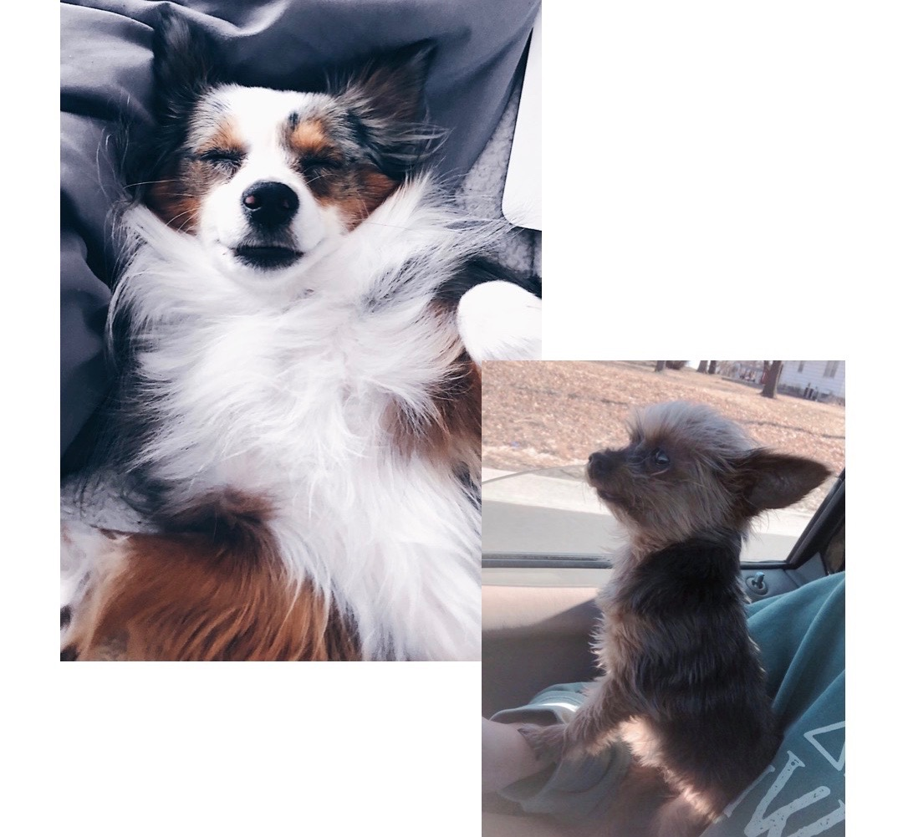

# This page is about my dogs
## I have two dogs named Rosalie and Nova.

We got Rosie when I wa in fifth grade and Nova my freshman year of college.  
Rosie is a toy yorkie and Nova is a mini australian shepherd.  
I love them both so much and they are great additions to my family.

[This is a page all about australian shepherds](https://dogtime.com/dog-breeds/australian-shepherd)

**Below is a picture of Rosie and Nova**

_We love to do activites with the dogs such as:_

* Walks
* Dog parks
* Teaching tricks
* Long car rides
* Giving them treats

<pre><code>
	<html>
	<html>
	<head>
	<meta charset="UTF-8">
	<title>Fizz Buzz</title>    
	
	

</head>

<body onload="fizzbuzz()">

</body>
</code></pre>

[README.md](https://github.com/rhedgpath/FinalProject/blob/master/README.md)   
[Page One](https://github.com/rhedgpath/FinalProject/blob/master/Page1.md)   
[Page Two](https://github.com/rhedgpath/FinalProject/blob/master/Page2.md)      
[Page Four](https://github.com/rhedgpath/FinalProject/blob/master/Page4.md)   
[Page Five](https://github.com/rhedgpath/FinalProject/blob/master/Page5.md)   
