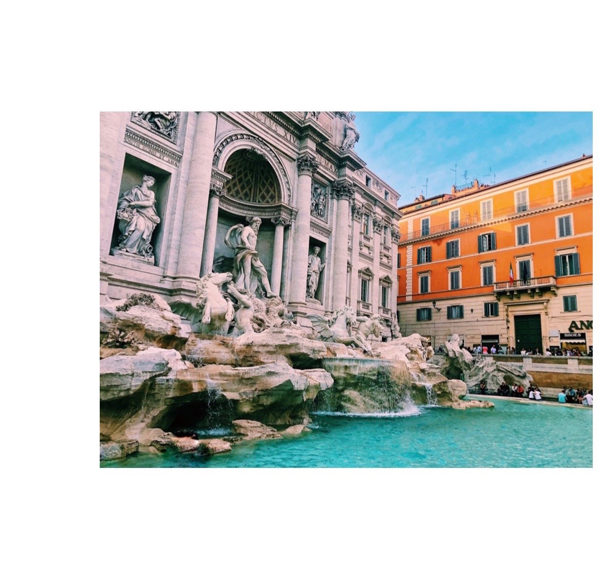

# This page is about Rome, Italy
## I studied abroad here summer 2018

I was able to study abroad with CIEE summer of my sophomore year.  
I went with two of my best friends from high school.  
One goes to the University of Arkansas and one goes to Texas Christian.  
We were there for a month and it was an amazing experience.

[This is the program I went through.](https://www.ciee.org/)

**Below is a picture I took while in Rome of the Trevi fountain.**

_I was able to go to more places in Italy while I was there, such as:_

* Venice
* Florence
* Tivoli
* Amalfi Coast

<pre><code>
	<html>
	<html>
	<head>
	<meta charset="UTF-8">
	<title>Fizz Buzz</title>    
	
	

</head>

<body onload="fizzbuzz()">

</body>
</code></pre>

[README.md](https://github.com/rhedgpath/FinalProject/blob/master/README.md)    
[Page One](https://github.com/rhedgpath/FinalProject/blob/master/Page1.md)   
[Page Two](https://github.com/rhedgpath/FinalProject/blob/master/Page2.md)   
[Page Three](https://github.com/rhedgpath/FinalProject/blob/master/Page3.md)     
[Page Five](https://github.com/rhedgpath/FinalProject/blob/master/Page5.md)   
