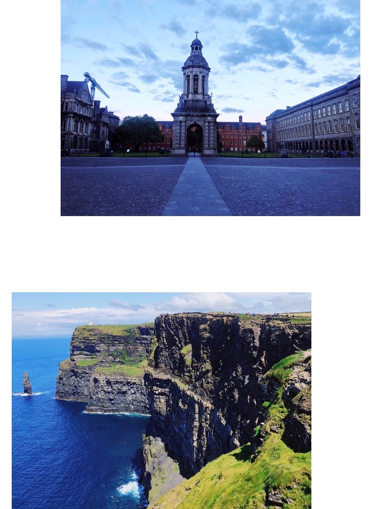

# This Page is about Ireland
## I studied abroad in Ireland summer of 2019

I was able to study abroad with my fellow IT students and go to Ireland.  
It was led by Brian Mauer and counted as my senior capstone.  
It was such an amazing experience and totally different from Italy.  

[This is the exact trip I went on.](https://engineering.missouri.edu/study-abroad-old/study-abroad-ireland/ireland-4100/)

**Below are two pictures I took in Ireland. Trinity College (Top) and Cliffs of Moher (Bottom)**

_We traveld to four different places in Ireland, listed below._

* Dublin
* Cork
* Killarney
* Galway

<pre><code>
	<html>
	<html>
	<head>
	<meta charset="UTF-8">
	<title>Fizz Buzz</title>    
	
	

</head>

<body onload="fizzbuzz()">

</body>
</code></pre>

[README.md](https://github.com/rhedgpath/FinalProject/blob/master/README.md)    
[Page One](https://github.com/rhedgpath/FinalProject/blob/master/Page1.md)   
[Page Two](https://github.com/rhedgpath/FinalProject/blob/master/Page2.md)   
[Page Three](https://github.com/rhedgpath/FinalProject/blob/master/Page3.md)   
[Page Four](https://github.com/rhedgpath/FinalProject/blob/master/Page4.md)    
